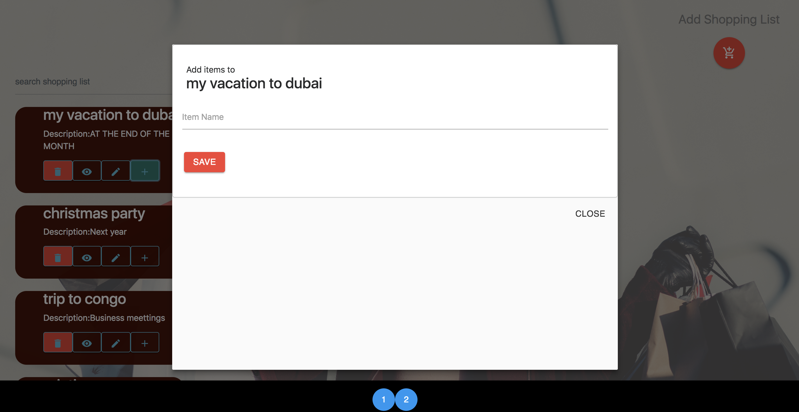
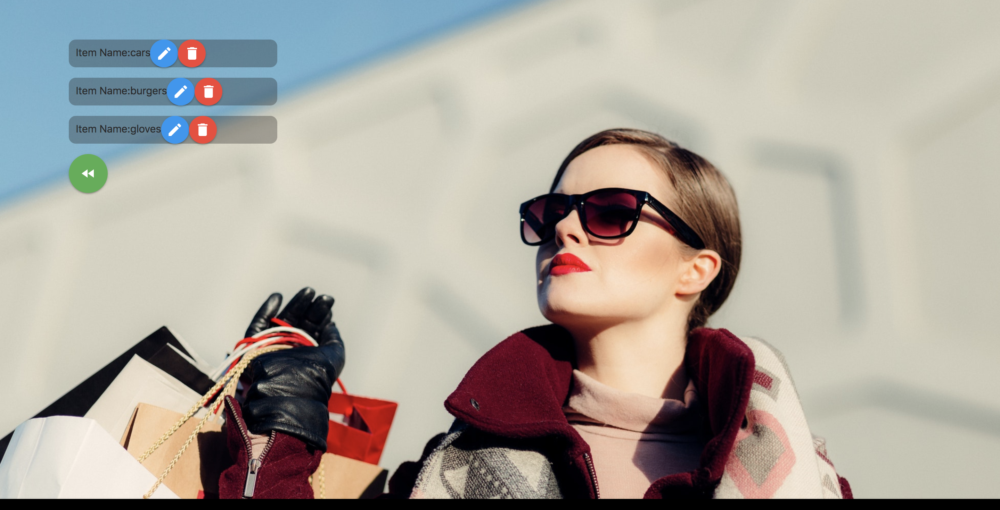

[]()
[](https://travis-ci.org/JoyLubega/Shoppinglist_React)


A shoppinglist app developed in react js that allows users to  create and take note of things they would want to buy.

# Getting Started
## Prerequisites
You will need to have the following:
> Node js - a javascript runtime  `use $brew install node` to install it. <br />

> React js - a javascript library for building UI, install using `npm install -g react`

## Installation
To install the app t you local PC, clone the repo by running
```git clone https://github.com/JoyLubega/Shoppinglist_React.git```<br />
After cloning the App, navigate to the directory to install required packages:

```
$cd shoppinglist
$npm install
```
## Start App
To launch the app run `npm start`

### Screenshots

>Register


>Login


>Dashboard


>Edit shoppinglist


>Items

## Deployment
```
Read the doc on how to deploy the application on https://www.heroku.com
```
